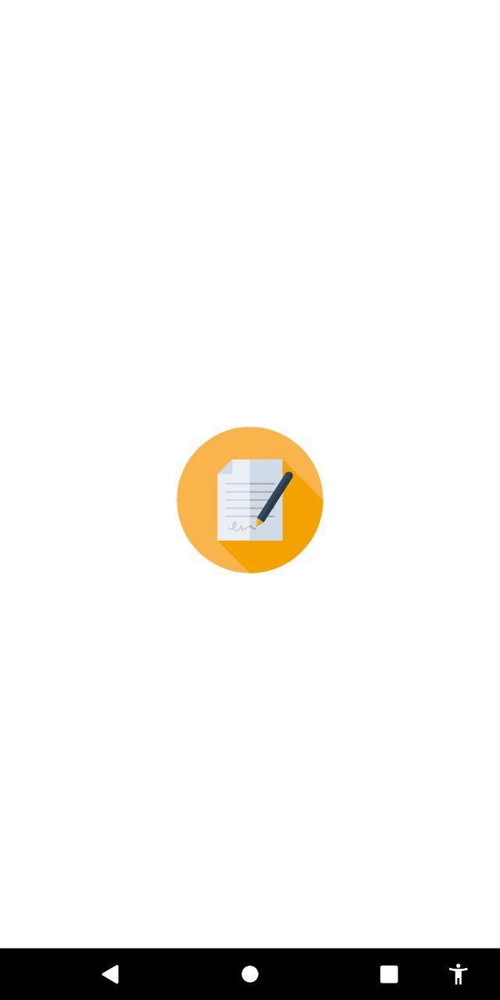
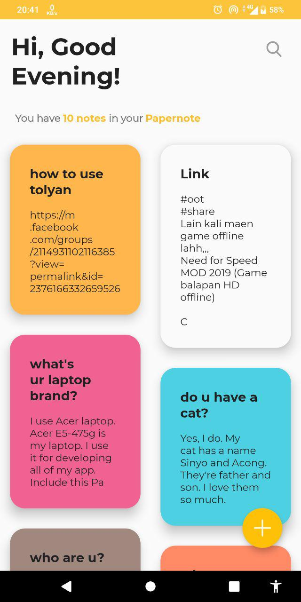
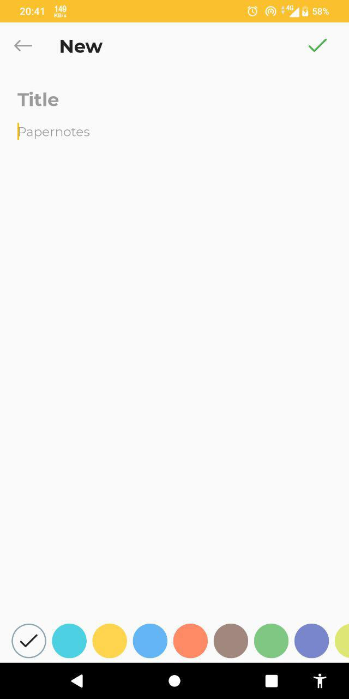
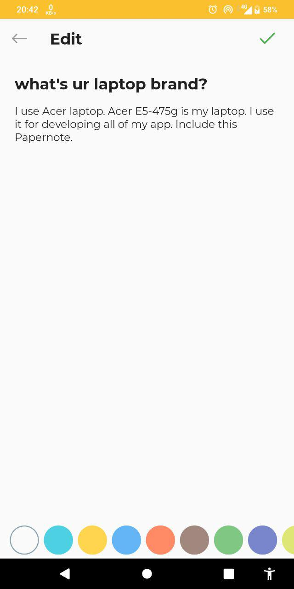
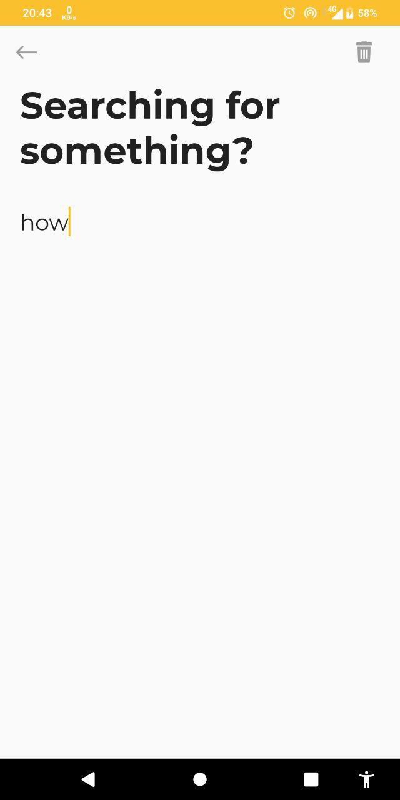
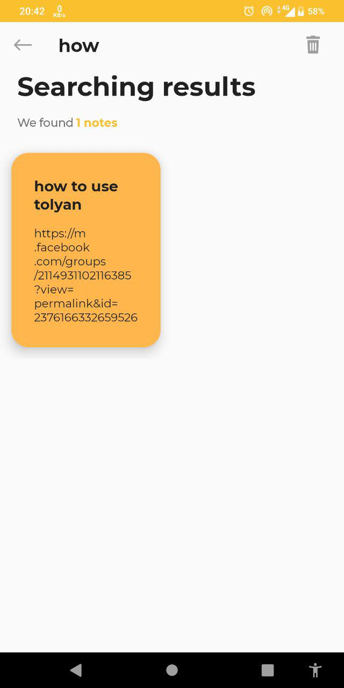

## Papernote
Aplikasi notes untuk mencatat hal-hal kecil yang sedang kamu pikirkan.

#### Fitur
- [x] Buat note baru
- [x] Edit - view note
- [x] Hapus note <b>(*slide ke kiri untuk menghapus note*)<b/>
- [x] Cari note

#### Teknologi
- [Android Studio](https://developer.android.com/studio)
- [Java](https://java.com)
- [Realm Database](https://realm.io)

#### Pustaka Sumber Terbuka
- [Realm Database](https://realm.io)
- [SDP & SSP for Responsive Design](https://github.com/intuit/sdp)
- [Art Illustration from Undraw](http://undraw.co)

#### Download link
[Papernote v1 - Google Drive](https://drive.google.com/open?id=1-AIaPp0ca8Ptb-8IIlfRgMtyy_DZmf5j)

#### Screenshot

| Splashscreen | Homepage |
| :---: | :---: |
|  | 

| New | View or Edit |
| :---: | :---: |
|  | 

| Search Form | Search Results |
| :---: | :---: |
|  | 
